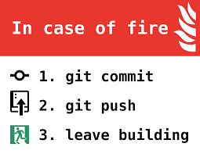

# Übungen FIAN Ausbildung

## Intitiale Aufgabe

1. Clone dieses Repository
2. Erzeuge ein Unterverzeichnis mit 19nachname.


- [24.10.2019 Zusatzaufgaben für Freitag](#zusatzaufgaben-berufschule-für-freitag)

## 1. Übung C Grundlagen Hello World. #CGrundlagen001

1. Erzeuge ein Projektordner unterhalb 19nachname mit dem Namen `CGrundlagen001`
1. Erzeuge eine `helloWorld.c` Datei.
2. Schreibe eine "Hello World" Anwendung.
4. Compiliere die Anwendung.

und..
> 

## Zusatzaufgaben:

 >**Mach dich Schlau:** 
 Recherchiere und erkunde, beschreibe die Funktionalität.

 Speichere die Dokumente unter 19nachname/CGrundlagen001/Aufgaben

- Was ist ein Compiler?
- Was kann **gcc**?
- Was für Alternativen gibt es zu **gcc** ?

>**Was macht eigentlich ..:** 

- Was kann ich mit dem Befehl `printf()` alles anfangen?
- Welche Datentypen gibt es in `c`
- Wie sind Strings in C definiert?


## Zusatzaufgaben Advanced.

Erstellen Sie innerhalb 

### CGrundlagenA001
 >Erstelle eine Konsolenanwendung mit folgender Userstory:

- Ich möchte den ganzahligen Wert eines Wochentages ermitteln für Sontag ist gleich 1, ...
- Das Program soll Wochentag2Zahl.exe heißen.
- Beim Start des Programms soll eine Beschreibung ausgegeben werden.
- Das Program erwartet den Wochentag als Text und Ausgabe als Zahl.

### CGrundlagenA002
>Erstelle eine Konsolenanwendung die mit den Winkel zwischen dem großen und kleinen Zeiger für eine beliebige Uhrzeit ausgibt. 


## Zusatzaufgaben Berufschule für Freitag

### C Grundlagen #CGrundlagenB001 

#### #CGrundlagenB001-1:

>  Erstelle eine Konsolenanwendung mit folgender Userstory:

- Ich möchte die Summe von 3 Zahlen ermitteln.
- Die drei Zahlen sollen ein einer Zeile durch Komma getrennt eingegeben werden.

**Beispiel:**
```
Eingabe: 5,10,15
Berechnung: 5+10+15 = 30
Ausgabe: Die Summe der Zahlen 5, 10, 15 beträgt: 30
``` 
#### #CGrundlagenB001-2:
>  Erstelle eine Konsolenanwendung zum Ermitteln ob eine Zahl gerade oder ungerade ist, mit folgender Userstory;

- Ich möchte von einer beliebigen ganzen Zahl wissen, ob sie gerade oder ungerade ist:

**Beispiel:**
```
Test Data: 15
Erwartete Ausgabe:
15 ist eine ungerade Zahl
```
#### #CGrundlagenB001-3:
> Erstelle eine Konsolenanwendung zum Ermitteln eines Schaltjahres

- Ich möchte von einem beliebigen Jahr wissen, ob es ein Schaltjahr ist oder nicht.

**Beispiel:**
```
Test Data : 2016 
Erwartete Ausgabe:
2016 ist ein Schaltjahr.
```
#### #CGrundlagenB001-4:
> Erstelle eine Konsolenanwendung zur Temperaturumrechnen von °C in F.

- Ich möchte wissen. wieviel Fahreinheit eine Teperatur in °C ist. 

**Beispiel:**
``
Test Data: 100
Eingabe Temperatur in Celsius = 100
Erwartete Ausgabe:
Temperatur in Fahrenheit = 212 F`
``