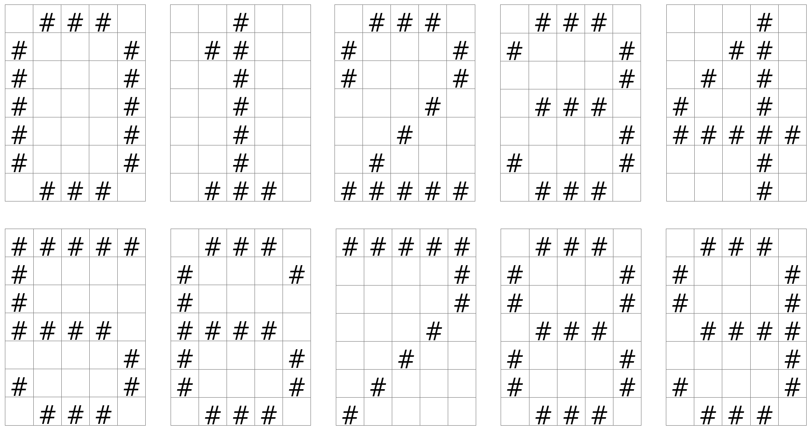

# Übungen FIAN Ausbildung

#### - [KW 46: Aufgaben der Woche C Grundlagen A003](#cgrundlagena003)
#### - [KW 46: Aufgaben der Woche C Grundlagen A004- IHK Typ](#cgrundlagena004)
#### - [Zusatzaufgaben für Freitag Berufschule](#zusatzaufgaben-berufschule-für-freitag)

## Intitiale Aufgabe
Eine Änderung

1. Clone dieses Repository
2. Erzeuge ein Unterverzeichnis mit 19nachname.


## 1. Übung C Grundlagen Hello World. #CGrundlagen001

1. Erzeuge ein Projektordner unterhalb 19nachname mit dem Namen `CGrundlagen001`
1. Erzeuge eine `helloWorld.c` Datei.
2. Schreibe eine "Hello World" Anwendung.
4. Compiliere die Anwendung.

**Beispiel:**
```c
//Hello World
#include <stdio.h>

int main() {
  printf("Hallo, Welt!");
  return 0;
}
```

und..
> 

## Zusatzaufgaben:

 >**Mach dich Schlau:** 
 Recherchiere und erkunde, beschreibe die Funktionalität.

 Speichere die Dokumente unter 19nachname/CGrundlagen001/Aufgaben

- Was ist ein Compiler?
- Was kann **gcc**?
- Was für Alternativen gibt es zu **gcc** ?

>**Was macht eigentlich ..:** 

- Was kann ich mit dem Befehl `printf()` alles anfangen?
- Welche Datentypen gibt es in `c`
- Wie sind Strings in C definiert?


## Zusatzaufgaben Advanced.

### CGrundlagenA001
 >Erstelle eine Konsolenanwendung mit folgender Userstory:

- Ich möchte den ganzahligen Wert eines Wochentages ermitteln für Sonntag ist gleich 1, ...
- Das Program soll Wochentag2Zahl.exe heißen.
- Beim Start des Programms soll eine Beschreibung ausgegeben werden.
- Das Program erwartet den Wochentag als Text und Ausgabe als Zahl.
---
### CGrundlagenA002
>Erstelle eine Konsolenanwendung die mit den Winkel zwischen dem großen und kleinen Zeiger für eine beliebige Uhrzeit ausgibt. 

---
### CGrundlagenA003

> Erstelle eine Konsolenanwendung zum Ausgeben von Zahlen mit folgenden Userstories:
>**Merke**
> 1. Erzeuge ein Projektordner unterhalb 19nachname mit dem Namen **CGrundlagenA003**
> 1. Erzeuge eine **README.md** Beschreibungen zum Program und zur Lösung.
> 2.1 Nutze PAP, Struktugramme und Pseudocode zur Umsetzung und dokumentiere es in der **README.md**
> 3. Kommentiere die Commits der Teillaufgaben zusätzlich mit dem Aufgabennamen z.B. **#CGrundlagenA003-A: Blabla...**
> 4. Gebe dem Commit mit dem Ergebnis zur Teilaufgabe zusätzlich einen **Tag** mit dem Namen der Teilaufgabe z.B. **#CGrundlagenA003-A**

#### CGrundlagenA003-A

- Als Anwender möchte ich eine Zahl zwischen 0-9 eingeben können
- Als Anwender möchte ich eine beliebige, einstellige Zahl in eine Textgrafik nach folgendem Schema umwandelt:  


 

**Die Ausgabe sollte etwa so aussehen:**
   
    >Geben Sie eine Zahl zwischen 0-9 ein: 3
     ### 
    #   #
        #
     ###
        #
    #   #
     ###

#### CGrundlagenA003-B

> Das Programm soll um folgene Userstories erweitert werden:

- Als Anwender möchte ich eine beliebige Zahlenfolge eingeben können.
- Die Ausgabe der Ziffern soll untereinander erfolgen.


#### CGrundlagenA003-C

> Das Programm soll um folgene Userstories erweitert werden:

- Als Anweder möchte ich eine dreistellige Zahlenfolge eingeben können.
- Die Ausgabe der Ziffern soll nebeneinander erfolgen.

**Die Ausgabe sollte etwa so aussehen:**
   
    > Geben Sie eine dreistellige Zahl zwischen 0-9 ein: 303
     ###    ###    ###
    #   #  #   #  #   #
        #  #   #      #
     ###   #   #   ###
        #  #   #      #
    #   #  #   #  #   #
     ###    ###    ###

---

#### CGrundlagenA004

Der Entwicklungsleiter der Jalousie-City GmbH hat eine neue Steuerung für die vollautomatischen Sonnenschutzjalousien entworfen. Diese sollen eine automatisch einstellbare Höhe haben, die der Benutzer voreinstellen kann (Sonnenschutz). Registriert der Sonnensensor also eine hohe Sonneneinstrahlung fährt die Jalousie bis zu der voreingestellten Höhe herunter. Zusätzlich ist ein Tag – Nacht – Modus integriert, das die Jalousien bei einer voreingestellten Zeit vollends herunterfahren und wieder hochfahren, wenn die morgendlich voreingestellte Zeit erreicht wurde.

1. Erstelle ein Struktogram
2. Erstelle eine c Konsolenanwendung, welche die Steuerung simuliert.

---

## Zusatzaufgaben Berufschule für Freitag

### C Grundlagen #CGrundlagenB001 

#### #CGrundlagenB001-1:

>  Erstelle eine Konsolenanwendung mit folgender Userstory:

- Ich möchte die Summe von 3 Zahlen ermitteln.
- Die drei Zahlen sollen ein einer Zeile durch Komma getrennt eingegeben werden.

**Beispiel:**
```
Eingabe: 5,10,15
Berechnung: 5+10+15 = 30
Ausgabe: Die Summe der Zahlen 5, 10, 15 beträgt: 30
``` 
#### #CGrundlagenB001-2:
>  Erstelle eine Konsolenanwendung zum Ermitteln ob eine Zahl gerade oder ungerade ist, mit folgender Userstory;

- Ich möchte von einer beliebigen ganzen Zahl wissen, ob sie gerade oder ungerade ist:

**Beispiel:**
```
Test Data: 15
Erwartete Ausgabe:
15 ist eine ungerade Zahl
```
#### #CGrundlagenB001-3:
> Erstelle eine Konsolenanwendung zum Ermitteln eines Schaltjahres

- Ich möchte von einem beliebigen Jahr wissen, ob es ein Schaltjahr ist oder nicht.

**Beispiel:**
```
Test Data : 2016 
Erwartete Ausgabe:
2016 ist ein Schaltjahr.
```
#### #CGrundlagenB001-4:
> Erstelle eine Konsolenanwendung zur Temperaturumrechnen von °C in F.

- Ich möchte wissen. wieviel Fahreinheit eine Teperatur in °C ist. 

**Beispiel:**
```
Test Data: 100
Eingabe Temperatur in Celsius = 100
Erwartete Ausgabe:
Temperatur in Fahrenheit = 212 F
```