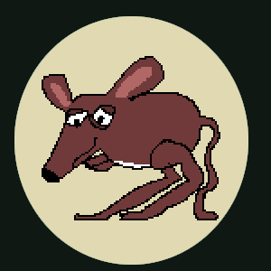

# Project Cklauß Dokumentation
Projectleiter: Mr. Heimburger 
Koordinator: Dennis 
Maskottchen: Cklauß die Kängurumaus

## Auftrag
Erstelle eine Website, die Oblique Strategies als Karte darstellt.

## Tasks
| Aufgabe | Arbeiter | difficulty | time |
|---|---|---|---|
|HTML und Projectstruktur|Sebastian|easy|3h|
|CSS Styling|Nils|medium|3h|
|Json File|Cody|easy|3h|
|Java Script für Webseitenfunktionalität|Dennis|hard|3h|
|Dokumentation|Benjamin|easy|3h|

## Statusbericht Montag 1.5h nach Beginn
- **HTML** 
    Grundgerüst erstellt 
    CSS und Java Script Datei eingebunden 
    Reload-Button erstellt

- **CSS** 
    Farbpalette definiert und dem Text zugewiesen 
    Formatierung des Maincontainer definiert

- **Json** 
    Ungefähr 100 Phrase Objekte mit Kategorie erstellt

- **Java Script** 
    Wenn_geladen-Funktion erstellt 
    Refresh-Funktion erstellt

- **Dokumentation** 
    Project Dokument erstellt 
    Tasks dokumentiert 
    Statusbericht jeden Arbeiters eingeholt

## Statusbericht Montag 4h nach Beginn
- immer noch nicht fertig zzzZZ

## Statusbericht Dienstag Morgen
- Felix and Pablo joined the squad
- Sebastian abwesend

## New Tasks
| Aufgabe | difficulty | time |
|---|---|---|
|UI anpassen an Vorlage in Slack|medium|3h|
|Favicon erstellen und in Webseite einbinden|medium|3h|
|Timerfunktion in JS programmieren|medium|3h|
|Dateinamen umbenennen|easy|1h|